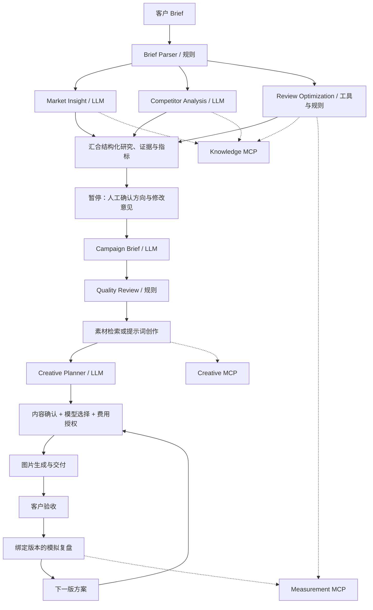

# AdInsight Agent
### 出海营销洞察、Campaign Brief 与广告创意交付工作台

从分散资料到可追溯策略，再到客户可验收的广告图片与下一版创意。

**React + FastAPI · RAG · 多 Agent 协同 · MCP · Human-in-the-loop**

**项目性质：个人独立 Demo。所有业务知识、竞品、历史 Campaign 和投放数据均为 mock，不代表任何公司项目，不连接真实广告账户。**

项目由个人独立设计、AI 辅助工程实现。[产品需求](docs/PRD.md) · [协作架构](docs/AGENT_WORKFLOW.md) · [体验路径](docs/DEMO.md) · [广告服务](docs/AD_CREATIVE_SERVICE.md) · [原型说明](docs/FIGMA_PROTOTYPE_GUIDE.md)

## 解决什么问题
出海 Campaign 的困难不只是写一份 Brief。产品约束、用户动机、竞品表达和复盘数据分散在不同材料中，研究难以查证，策略到创意容易丢失上下文，下一轮又需要重新整理。

| 业务问题 | 产品设计 | 可检查的结果 |
|---|---|---|
| 资料分散、结论泛化 | 产品与地区过滤后检索，按角色分配证据 | 来源 ID、原文与匹配原因 |
| 研究等待、结论难汇总 | 市场、竞品、复盘三路并行，结构化交接 | 实际事件、输入输出与耗时 |
| 建议直接变成决策 | 研究后暂停，人工选择方向与修改意见 | 确认记录和最终 Brief |
| 策略无法进入交付 | 继承 Brief，素材复用或提示词创作 | 图片、文案、提示词与分镜 |
| 复盘和下一版脱节 | 指标绑定已确认广告，反馈回流规划 | 父版本、复盘与 V2 方案 |

## 协作架构


### 多 Agent 不是多个聊天窗口
三个研究分支通过 Python `asyncio.TaskGroup` 真正并行，只有全部完成并经过人工确认后才生成 Brief。角色交换经过 Schema 校验的研究、来源、指标与决策，不共享无限增长的聊天历史。生成和确定性计算分离；新增 Creative Planner 将策略转成客户可编辑的创意方案。

这些角色可以使用同一个模型，不代表多个独立训练的模型。多角色的价值在于分工、交接约束与可观察性，不自动意味着更准确；与同模型单次提示词方案的质量、修改时间、延迟和成本对照仍待评估。

### MCP、RAG 与 Agent 分别负责什么
| 概念 | 本项目中的职责 | 实现入口 |
|---|---|---|
| Agent | 谁处理什么问题、依赖谁的输出 | [workflow.py](backend/services/workflow.py)、[agents](backend/agents) |
| MCP | 标准化访问受限工具，记录调用过程 | [mcp_server.py](backend/mcp_server.py)、[mcp_gateway.py](backend/services/mcp_gateway.py) |
| RAG | 检索相关资料，为生成提供证据上下文 | [rag_retriever.py](backend/agents/rag_retriever.py) |
| 人工确认 | 决定方向、内容、外部费用与交付是否接受 | [用户流程](docs/USER_FLOW.md)、[广告服务](docs/AD_CREATIVE_SERVICE.md) |

| MCP 服务 | 只读工具定义 |
|---|---|
| knowledge | `knowledge_catalog`、`search_knowledge` |
| measurement | `sample_performance`、`calculate_metrics`、`plan_experiment` |
| creative | `search_creatives`、`get_creative` |

工具通过真实 stdio 子进程执行。动态发现 Schema、角色白名单与调用日志共同约束工具使用。工具选择由编排器指定，不是模型自主 Tool Calling；可能收费的图像请求单独授权，不包装成只读 MCP。

RAG 使用 13 条本地合成记录，先按产品和地区过滤，再通过字符级 TF-IDF 排序。没有向量数据库，不抓取实时市场。来源存在性校验不等于结论真实性证明。

## 0.3 广告服务闭环
客户需求 → 研究与 Brief 确认 → 素材检索 / 提示词创作 → 选择图像模型 → 生成图片 → 人工确认交付 → 模拟投放复盘 → 新一轮创意。

- 新增“广告创意交付”模块；从已完成 Brief 的“制作广告”入口继承上下文，也可直接接收独立客户需求。
- 6 个合成素材方案、3 张 AI 合成主视觉；真实 creative MCP 检索、匹配检查与来源记录。
- 可编辑标题、正文、CTA、视觉提示、禁用内容与 15 秒分镜；选择本地排版、OpenAI GPT Image 2 或 Google Nano Banana 2。
- PNG 和 ZIP 交付包、客户确认、绑定版本的模拟投放复盘、父版本回溯；复盘意见可创建 V2，须重新确认后才生成图片。
- 图像调用有显式费用授权、幂等与失败状态；不会静默切换模型或伪装生成成功。

详细范围与接口见 [广告创意交付说明](docs/AD_CREATIVE_SERVICE.md)。本版视频只交付分镜与提示词，不生成视频成片，不自动发布广告。

## 研究工作台
- 6 个有明确输入输出的 Agent 阶段：解析、市场、竞品、复盘、Brief、规则质检。
- 市场 / 竞品 / 复盘真正并行，完成后暂停，等待人工选择创意方向并补充意见。
- 3 个真实 MCP stdio 服务，7 个只读工具，动态发现工具定义、按角色白名单调用、记录输入输出与耗时。
- 中文字符级 TF-IDF + 产品 / 地区筛选，稳定来源 ID、原始记录、无证据提示。
- CTR、CVR、CPA、ROAS、素材采纳率从原始数据计算；提供三种合成场景与固定样本 A/B 计划。
- SSE 阶段更新、断线轮询兜底、本地任务历史、取消、删除、人工确认记录、Markdown 复制与导出。
- 更紧凑的单页工作台：固定主操作、结果标签页、按需展开来源与日志、轻量动画及减少动态效果支持。

这些 Agent 是受约束的角色工作流，不是六个独立训练的模型。工具选择由编排器确定，不宣称模型自主规划或已接入线上投放系统。

## 立即运行
建议 Python 3.12、Node.js 22.12+。从 GitHub 下载源码或克隆：

```bash
git clone https://github.com/Metre888/adinsight-agent.git
cd adinsight-agent
```

仓库不包含虚拟环境、node_modules 或 dist。首次使用先按下面步骤安装依赖；默认无需密钥，完整链路可以在 Mock 模式运行。

### 全新环境
建议 Python 3.12；前端构建要求 Node 22.12+（或 Node 20.19+）。

后端：

```bash
cd backend
python -m venv .venv
source .venv/bin/activate
pip install -r requirements.txt
uvicorn main:app --host 127.0.0.1 --reload --port 8000
```

Windows PowerShell 激活：`.venv\Scripts\Activate.ps1`；CMD 激活：`.venv\Scripts\activate.bat`。如果系统的 `python` 不存在，请使用 `python3`。

前端开发（另一个终端）：

```bash
cd frontend
npm ci
npm run dev
```

开发地址：**http://127.0.0.1:5173/**。Vite 将 `/api` 代理到 8000。改动完成后执行 `npm run build`，再重启后端，8000 页面将使用最新构建。远离公网部署，默认只绑定回环地址。

### 单服务展示
安装后端依赖后，在 frontend 执行 `npm run build`。停止之前的后端开发服务，再在项目根目录执行：

```bash
backend/.venv/bin/python tools/launch.py
```

Windows 使用 `backend\.venv\Scripts\python.exe tools\launch.py`；macOS 也可运行 `zsh start.command`。启动器选择 8000–8009 的空闲端口，FastAPI 同时提供页面和 API，打开终端打印的地址即可。开发模式端口冲突时，需同步修改后端端口和 Vite 的代理目标。

下载较慢时可使用镜像：

```bash
pip install -r requirements.txt -i https://mirrors.aliyun.com/pypi/simple
npm install --registry=https://registry.npmmirror.com
```

### DeepSeek 配置
在 `backend/` 复制 `.env.example` 为 `.env`：

```bash
cp .env.example .env
```

```dotenv
DEEPSEEK_API_KEY=你的密钥
DEEPSEEK_MODEL=deepseek-v4-flash
```

重启后端生效。使用 OpenAI 兼容 SDK，base URL 为 `https://api.deepseek.com`。默认模型按 2026-09-07 官方文档更新为 DeepSeek V4 Flash，也可通过环境变量更换可用模型。为降低结构化任务延迟，显式关闭 thinking。

**没有密钥：**市场、竞品与 Brief 使用有明确标签的本地模板；MCP、RAG、并行编排、人工确认、指标计算仍真实运行。
**调用失败 / 超时 / 非法 JSON / 错误引用：**该阶段自动降级，页面和导出保留模式记录，不静默假装模型成功。
健康接口里的 mode 代表配置状态；每个 Agent 的 meta.mode 才代表这一步实际使用的模式。配置密钥后，Brief 和检索到的合成资料会发送至 DeepSeek，勿输入敏感信息。

### 配置图片模型（可选）
在已有 backend/.env 中添加，不要覆盖已有 DeepSeek 配置：

```dotenv
OPENAI_API_KEY=你的_OpenAI_密钥
GEMINI_API_KEY=你的_Gemini_密钥
```

重启后端，在创意方案页刷新模型配置。无需全部配置；没有图像密钥可完整使用“本地排版预览”。本地模式是模板排版，不是图像大模型生成；自由画面提示词仅在真实图像模型中执行。配置不代表账号权限和额度已验证。每次外部生成都需勾选数据发送与可能费用授权；不要在聊天或浏览器中填写密钥。

Linux 中文预览需可用 CJK 字体，可通过 ADINSIGHT_FONT_PATH 指向字体文件。English 为默认交付语言。

## 操作路径
1. 使用预填的 LumaSnap 项目，或选择语言学习 / 休闲游戏示例。
2. 点击“开始研究”，观察阶段状态；在“执行与工具”查看 MCP 调用。
3. 在“研究结论”检查来源，选择创意方向，填写修改意见并确认合成数据声明。
4. 点击“确认并生成 Brief”；在 Brief 标签页复制或下载 Markdown。
5. 点击“制作广告”；选择历史素材，或切换“从提示词创作”，点击“生成创意方案”。
6. 修改广告文案与提示词，选择模型并确认；无密钥时使用本地排版预览。
7. 下载图片或交付包；检查后“确认交付版本”，进入模拟投放复盘。
8. 提交模拟计数与客户反馈，查看指标和实验假设；点击“带入复盘，创建 V2”，形成下一版待确认方案。
9. 用历史任务 / 历史交付恢复结果；研究沙盘仍独立，不会改写广告版本复盘。

全流程不会发布广告，不会修改预算。生成稿仍需要核对产品能力、价格、语言和归因口径。

## 技术栈与目录
React 18 / Vite 8 / CSS / Lucide；FastAPI / Pydantic；DeepSeek AsyncOpenAI；MCP Python SDK 2.1.1；scikit-learn / Pillow；本地 JSON。

```text
adinsight-agent/
  start.command
  frontend/
    src/                  # 工作台、表单、结果、来源对话框
    dist/                 # npm run build 生成，不提交仓库
    vite.config.js        # React JSX 与开发代理
  backend/
    main.py               # REST、SSE、前端托管
    models.py             # 研究输入与输出约束
    creative_models.py    # 创作 / 生成 / 审批 / 复盘 Schema
    creative_api.py       # 广告服务 REST
    mcp_server.py         # knowledge / measurement / creative stdio 服务
    agents/               # 六个阶段与检索器
    services/
      workflow.py         # 并行编排、人工暂停、持久化
      mcp_gateway.py      # 发现、白名单、超时、调用记录
      measurement.py      # 确定性指标与实验估算
      llm_service.py      # DeepSeek 与显式降级
      creative_service.py # 方案、生成幂等、交付、复盘与迭代
      creative_library.py # 合成素材过滤与来源
      image_providers.py  # 本地排版 / OpenAI / Google
    data/                 # 四类 mock 知识 + creative_library.json + assets/
    tests/
    .runtime/             # 运行时产生，不提交仓库
  docs/
    PRD.md
    FIGMA_PROTOTYPE_GUIDE.md
    USER_FLOW.md
    AGENT_WORKFLOW.md
    EXPERIENCE_AUDIT.md
    AD_CREATIVE_SERVICE.md
    DEMO.md
  tools/launch.py
```

## API
- GET `/api/health`：服务 / 配置模式。
- GET `/api/knowledge`：四类知识覆盖。
- GET `/api/integrations`：实际连接三种 MCP 服务并列出工具。
- POST `/api/runs`：创建任务，202 返回任务快照。
- GET `/api/runs`、GET `/api/runs/{id}`：历史与详情。
- GET `/api/runs/{id}/events`：SSE snapshot；连接时先发送最新完整快照。
- POST `/api/runs/{id}/approve`：direction_id、feedback、acknowledged=true。
- POST `/api/runs/{id}/cancel`、DELETE `/api/runs/{id}`。
- GET `/api/runs/{id}/export`：仅完成后导出 Markdown。
- POST `/api/review`：scenario 或原始 metrics，返回计算结果。
- POST `/api/analyze`：兼容研究入口，等待研究完成，返回 run_id 与 requires_approval；不会跳过人工确认生成最终 Brief。相较 0.1，campaign_brief 在确认前为空。

交互式 API 文档：**http://127.0.0.1:8000/docs**。详细字段以 Pydantic / OpenAPI 为准。

广告模块 API 位于 `/api/creative`，包括 providers、materials、plans、generate、jobs、approve、review、iterate、image 和 bundle；字段说明见广告服务文档及 OpenAPI。

## 测试
```bash
cd backend
.venv/bin/python -m pytest -q
cd ../frontend
npm run build
```

测试包含真实 MCP 子进程与工具发现、产品 / 市场过滤、无证据处理、指标数学、非法输入、并行阶段、审批前导出拒绝、重复审批、取消、重启恢复、JSON 与引用失败降级、API 和 SSE；新增创意闭环、真实素材 MCP、重复请求、付费授权、参考图适配、图片验证和 ZIP 内容测试。

## 常见问题
- **旧 HTML 页面与新功能不一致？**统一使用终端显示的 HTTP 地址。真实 MCP 服务需要后端，不能靠双击离线 HTML 启动。
- **8000 还是旧界面？**重新 build 并重启后端；Vite 开发页面在 5173。
- **MCP 不可用？**确认当前虚拟环境安装 `mcp==2.1.1`，Python 子进程有执行权限。工具异常会使任务失败并保留阶段结果，不伪装为成功 MCP 调用。
- **模型超时？**单次 SDK 超时 25 秒，外层 30 秒；无自动重试风暴，转为本地合成结果。
- **没有匹配来源？**Demo 覆盖有限，空结果是预期行为。不能用不相关国家的材料补齐“证据”。
- **为何 A/B 要几十天？**估算基于每日 300 次点击、20% 相对 MDE、95% 置信水平与 80% 功效，样本不足不宣布赢家。
- **历史保存在哪里？**本地 `backend/.runtime/runs/`，最多 50 个任务、同时 3 个运行任务。单进程部署；刷新可恢复，重启后运行中任务标记中断，待审批任务可以继续。
- **可以直接公网部署吗？**不可以。本 Demo 没有身份鉴权、租户隔离或企业密钥管理，只面向本机。

广告记录保存在 `backend/.runtime/creative/`，规划 / 生成分别最多 100 份，并发上限 3 / 2。达到上限不会自动删除交付。图像服务单次最长 180 秒，无自动重试；重启后运行任务标记中断，不代表服务商没有计费。

## 文档与素材
当前规范以 0.3 代码及 Markdown 为准。完整操作和预期状态见 [体验路径](docs/DEMO.md)；设计布局、组件和状态见 [Figma 原型指南](docs/FIGMA_PROTOTYPE_GUIDE.md)。指南不是已经创建的在线 Figma 文件。

<details>
<summary>查看素材库合成参考视觉</summary>

下图是 AI 合成参考素材，不是工作台截图，也不是广告投放效果证据。


</details>

尚未完成真实用户效果对照或外部计费模型端到端验证，不宣称用户规模、提效比例或广告收益。测试替身验证模型适配载荷，不能代替服务商实际调用。边界见 [验收记录](docs/EXPERIENCE_AUDIT.md)、[安全说明](SECURITY.md) 与 [第三方及素材说明](THIRD_PARTY_NOTICES.md)。

## 后续扩展
先建立真实数据授权、指标口径和离线评测，再接向量库 / 重排、正式实验模块、多语言审核、广告平台只读 MCP；任何写入动作需增加鉴权、费用限制、审批与幂等回执。相关设计见 docs/AGENT_WORKFLOW.md。
