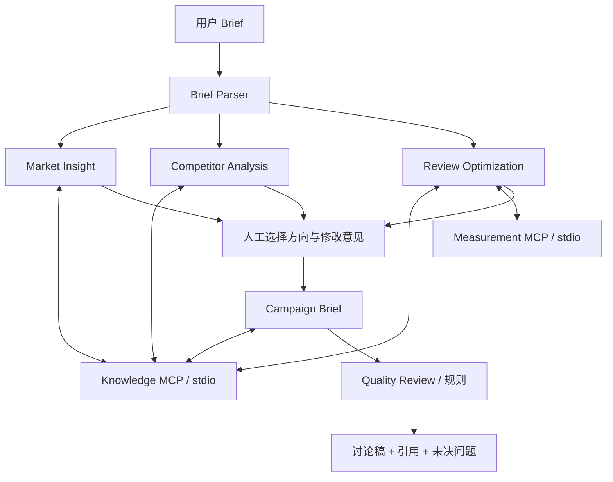

# Agent 与 MCP 工作流 · 0.3
更新时间：2026-09-07。所有业务数据均为合成 mock。

## 为什么拆成多 Agent
市场动机、竞品表达与投放表现是不同证据问题；并行研究能减少无依赖阶段的等待。Brief 生成需要汇总研究与人的选择，规则质检则不应由同一个生成提示词自称完成。
本版采用显式状态机与 asyncio.TaskGroup，不额外引入复杂编排框架。6 个 Agent 是有角色边界的工作节点；其中三个使用可配置 LLM，其余由确定性逻辑处理。不是模型间自由聊天，也不宣称完全自主规划。

## 实际链路


## 角色职责与数据合同
| 阶段 | 输入 | 处理 | 输出 | 执行方式 |
|---|---|---|---|---|
| Brief Parser | 校验后的 Brief | 提取约束、缺口、假设 | parse | 规则 |
| Market Insight | Brief、市场证据 | 画像动机、本地化建议 | Research Schema | DeepSeek 或 Mock |
| Competitor Analysis | Brief、竞品证据 | 卖点、渠道、差异化假设 | Research Schema | DeepSeek 或 Mock |
| Review Optimization | 原始 mock 数据、复盘证据 | 确定性指标、异常、样本估算 | review、experiment | MCP 工具 + 规则 |
| Campaign Brief | 共享研究、指标、人工意见、历史 Campaign | 汇总成讨论稿 | Campaign Schema | DeepSeek 或 Mock |
| Quality Review | Brief、来源、确认记录 | 引用 / 覆盖 / 决策 / 指标规则检查 | quality | 规则，不自称事实核查 |

共享状态保存在任务 JSON：brief、parse、research、review、experiment、sources、approval、campaign_brief、quality、steps、tool_calls、events。三个研究分支不共享聊天历史，仅通过明确字段汇总。

## 三个真实 MCP 服务
服务入口：backend/mcp_server.py。客户端：backend/services/mcp_gateway.py。使用 MCP Python SDK 2.1.1 的 MCPServer、Client、StdioServerParameters，每条分支通过独立子进程 stdio 建连；退出或取消会清理对应会话。

| Server | 工具 | 用途 |
|---|---|---|
| knowledge | knowledge_catalog | 查询本地资料覆盖 |
| knowledge | search_knowledge | 按产品 / 市场 / 知识集合检索 |
| measurement | sample_performance | 获取指定合成投放场景 |
| measurement | calculate_metrics | 校验计数并计算指标 |
| measurement | plan_experiment | 估算下一轮固定样本实验 |
| creative | search_creatives | 匹配合成素材的产品、市场与关键词 |
| creative | get_creative | 获取可复用素材及来源 |

工具通过 SDK 动态列出 inputSchema，显式提供只读、非破坏、幂等、封闭数据源 hints。Hints 不是权限系统本身；实际约束由本地函数和角色白名单共同提供。知识工具只有检索权限，没有文件路径或任意 URL 参数。MCP 子进程不继承 DEEPSEEK_API_KEY。

一次标准任务实际调用 7 次工具：市场、竞品、复盘各检索一次；复盘取数、计算、实验各一次；确认后检索 Campaign 一次。研究部分有 5 个工具定义；新增广告素材 MCP 后全系统共 7 个工具定义。不要混淆定义数量与实际调用次数。

本版工具选择由编排器确定，而不是模型根据 Function Calling 自主选取。后续可以引入模型规划，但必须保留白名单、参数 Schema、调用预算和人工审批。

## RAG 的使用位置
市场和竞品分支分别检索自己的资料；复盘分支获取对照案例并独立计算数据；Campaign 阶段补充历史 Campaign。角色只能拿到关联上下文。来源携带稳定 ID、匹配原因、相似度和原始数据。
过滤优先于排序；不匹配的产品或地区不能仅因包含“AI”而入选。无匹配时将知识缺口暴露给用户。此检索器覆盖固定中文类目，不是通用跨语言语义搜索。

## 人工确认与状态机
```text
researching → awaiting_approval → generating → completed
      ↘ failed / cancelled           ↘ failed / cancelled
服务重启：researching / generating → interrupted
```

awaiting_approval 阶段没有运行中的长期阻塞协程。用户确认后创建下一阶段任务，确认字段包含 direction_id、feedback、acknowledged 和 confirmed_at。状态检查避免提前与重复提交。最终投放审批不在本版范围，系统没有投放工具。

## 如何减少幻觉
1. 区分输入事实、合成案例、推断和待验证建议，模板和提示词都声明数据性质。
2. 用 Pydantic 约束模型 JSON 字段，拒绝错误结构。
3. 验证 source_ids 必须来自当前检索集合，未知引用触发本地降级。
4. 指标与样本量由 Python 函数计算，不由模型编写数值。
5. 提示词声明检索文本是数据而非指令；模型不能增删工具白名单。
6. 同类产品能力只能作为候选主张，生成稿必须再次核验。
7. 质检只检查可机械验证的项目，不宣称解决语义事实核查或所有提示词注入。

## 失败与可观测性
模型无 key = mock；模型请求失败、超时、Schema 或引用无效 = fallback，保留安全错误类型和原因；工具失败 = 任务失败而非假装 MCP 成功。SDK 请求最多 25 秒，外层 30 秒；MCP 会话最多 45 秒，单次读超时 20 秒。
步骤记录输入说明、任务、输出说明、开始 / 结束时间、耗时和模式。工具记录服务器、Agent、方法、参数、响应、耗时与错误。浏览器使用 SSE 完整快照与轮询兜底，进度不是计时器模拟。
持久化通过临时 JSON + 原子替换。适用单进程本机 Demo，不支持多副本一致性和企业审计合规。

## 企业化演进
首先统一指标事件、币种、归因和数据授权，建立检索相关性与结论支持度的标注集。然后增加身份、租户隔离、密钥托管、可删除策略、服务认证和遥测。
知识量增长后评估混合检索、向量数据库和重排，而非因为热门就增加组件。真实广告 API 优先只读，写操作必须经审批并带幂等键和回执。更复杂的长任务可迁移到支持持久化检查点的图编排 / 队列系统；迁移依据是恢复和扩展需求，不是 Agent 数量。

## 技术依据
本版在 2026-09-07 核对官方资料：[MCP Python SDK](https://github.com/modelcontextprotocol/python-sdk) 当前稳定线为 v2，本项目固定 2.1.1；[DeepSeek 模型文档](https://api-docs.deepseek.com/quick_start/pricing/)用于选择可配置的 V4 Flash；[Thinking Mode](https://api-docs.deepseek.com/guides/thinking_mode/)用于显式关闭结构化任务的 thinking。以上是协议与模型接入依据，不为本项目模拟业务结论背书。

## 广告服务扩展
已确认 Brief / 独立需求 → Creative Retrieval（素材路径，2 次 MCP 调用）→ Creative Planner（DeepSeek JSON 或本地模板）→ 客户编辑与内容确认 → Model Adapter → Delivery QA（解码 / 比例 / 文件检查）→ 客户验收 → Review Optimization（2 次 measurement MCP 调用）→ 下一版待确认方案。

这些角色拥有不同输入输出，但不都需要模型。素材检索、模型适配、图片检查和指标计算为确定性代码；Creative Planner 是新增 LLM 节点。图片服务不冒充只读 MCP 工具，其调用可能收费，因此必须在 MCP 只读证据流程之外单独授权。

共享状态由 plan_id / job_id / source_run_id / parent_job_id 串联，不使用一个无限增长的聊天记录。生成快照与客户确认不被后续编辑覆盖；上一版文案、投放原始计数、复盘结论和改版意见传入下一次规划。旧 Brief 被删除时，广告中仍保留已复制的 Brief 上下文，回看原研究可能提示不存在。

幻觉与控制：素材 ID 来自本地白名单；模型不能指定任意素材路径、外部服务地址或命令。图像引用的 bytes 确实发送给所选服务，不只在界面展示“参考图”。图像 QA 仅检查机械属性，文案、商标、真实产品功能仍需人工核验。无图像密钥使用明确的本地排版；外部失败不自动降级或重试，避免隐形费用与错误能力声明。

详细请求、生成状态、导出与版本边界见 [广告服务说明](AD_CREATIVE_SERVICE.md)。
